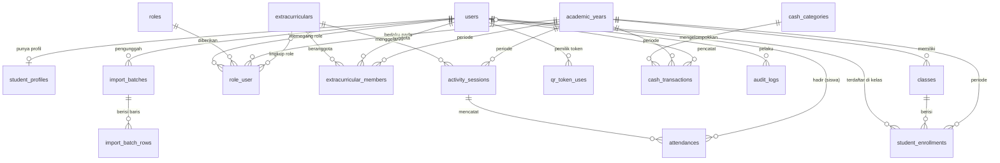
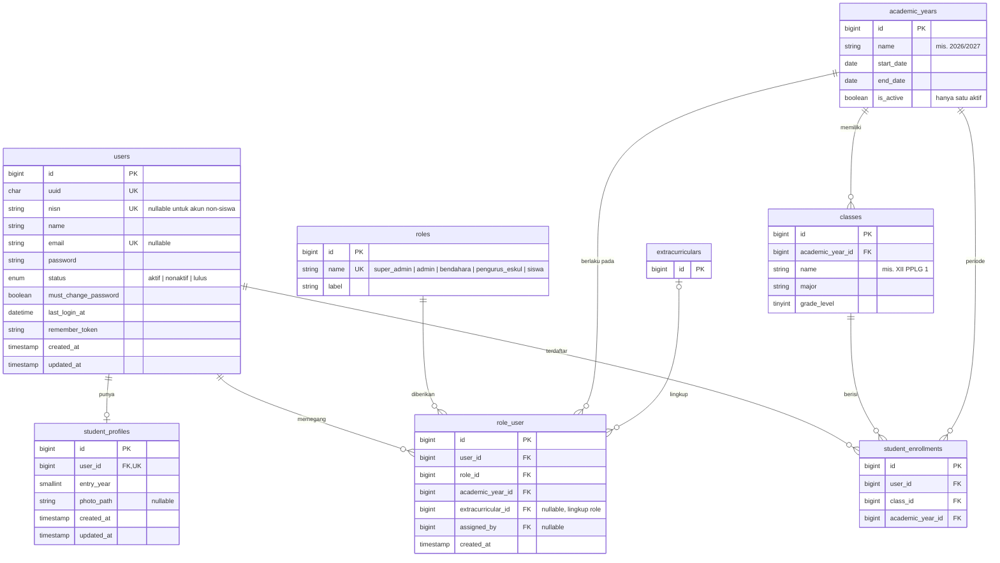
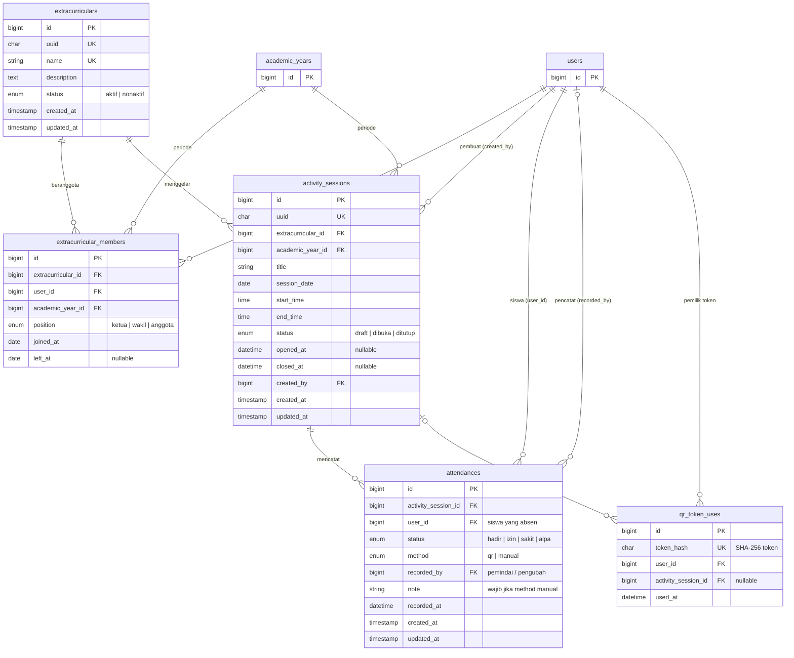
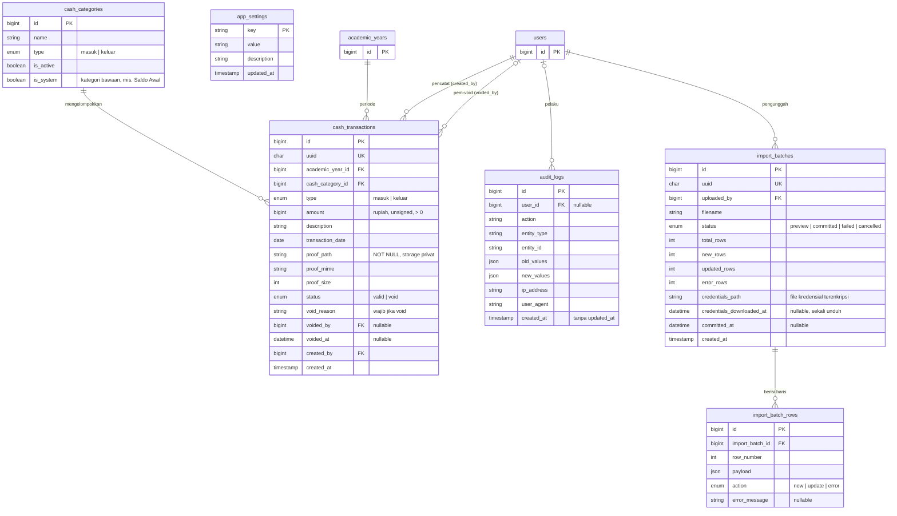

# 🗄️ ERD Lengkap: Noteify Hub (Fase 1 MVP)

Turunan dari **PRD v3.0** Bagian 5. Dokumen ini berisi: gambaran umum relasi, tiga diagram detail per domain, kamus data, aturan integritas, indeks, dan urutan migration Laravel.

**Konvensi umum**
- Semua tabel memakai `id` (bigint, PK) untuk relasi internal. Tabel yang tampil di URL/API punya `uuid` (unik).
- Uang disimpan sebagai **bigint rupiah** (tanpa desimal) untuk menghindari galat floating point.
- Timestamp `created_at` / `updated_at` standar Laravel, kecuali dicatat lain.
- Foreign key riwayat (presensi, kas, audit) memakai **RESTRICT / SET NULL**, tidak pernah CASCADE DELETE.
- Keterangan `UK` = unique, `FK` = foreign key, `PK` = primary key.

---

## 1. Gambaran Umum (Relasi Antar Tabel)



---

## 2. Domain Identitas, Role, dan Akademik



---

## 3. Domain Eskul dan Presensi



---

## 4. Domain Kas, Audit, Import, dan Sistem



---

## 5. Constraint dan Indeks

| Tabel | Unique | Indeks tambahan | Catatan |
|---|---|---|---|
| `users` | `uuid`, `nisn`, `email` | `status` | `nisn`/`email` nullable; MySQL mengizinkan banyak NULL pada unique |
| `student_profiles` | `user_id` | n/a | Relasi 1–1 dengan `users` |
| `academic_years` | `name` | `is_active` | Hanya satu `is_active = true` (ditegakkan di aplikasi dalam transaksi) |
| `classes` | `(academic_year_id, name)` | n/a | |
| `student_enrollments` | `(user_id, academic_year_id)` | `class_id` | Satu kelas per siswa per periode |
| `roles` | `name` | n/a | Diisi lewat seeder |
| `role_user` | lihat catatan ⚠️ di bawah | `(user_id, academic_year_id)` | Dipakai di tiap request untuk membaca role aktif |
| `extracurriculars` | `uuid`, `name` | n/a | |
| `extracurricular_members` | `(extracurricular_id, user_id, academic_year_id)` | `(user_id, academic_year_id)` | Keluar = isi `left_at`, bukan hapus baris |
| `activity_sessions` | `uuid` | `(extracurricular_id, session_date)`, `status` | |
| `attendances` | **`(activity_session_id, user_id)`** | `(user_id, recorded_at)` | Mencegah absen ganda; indeks kedua untuk histori siswa |
| `qr_token_uses` | `token_hash` | `used_at` | Dibersihkan terjadwal (data > 1 hari tidak diperlukan) |
| `cash_categories` | `(type, name)` | n/a | |
| `cash_transactions` | `uuid` | `(academic_year_id, status, transaction_date)`, `cash_category_id` | Indeks utama untuk saldo dan laporan |
| `audit_logs` | n/a | `(entity_type, entity_id)`, `(user_id, created_at)`, `(action, created_at)` | Tabel tumbuh cepat; pertimbangkan partisi/arsip tahunan |
| `import_batches` | `uuid` | `(uploaded_by, status)` | |
| `import_batch_rows` | `(import_batch_id, row_number)` | n/a | Bisa dibersihkan setelah batch final |
| `app_settings` | `key` (PK) | n/a | |

> ⚠️ **`role_user` dan NULL pada unique.** Kolom `extracurricular_id` bernilai NULL untuk role global (Admin, Bendahara). MySQL menganggap NULL berbeda satu sama lain, sehingga unique `(user_id, role_id, academic_year_id, extracurricular_id)` **tidak mencegah duplikat role global**. Solusi: tambahkan kolom *generated* `scope_key = COALESCE(extracurricular_id, 0)` dan buat unique pada `(user_id, role_id, academic_year_id, scope_key)`.

### Perilaku Foreign Key

| Relasi | ON DELETE |
|---|---|
| `attendances.activity_session_id`, `.user_id`, `.recorded_by` | RESTRICT |
| `cash_transactions.*` (semua FK) | RESTRICT |
| `audit_logs.user_id` | SET NULL |
| `student_profiles.user_id` | CASCADE (data turunan murni) |
| `import_batch_rows.import_batch_id` | CASCADE |
| `role_user.*`, `extracurricular_members.*` | RESTRICT (akhiri dengan `left_at` / nonaktifkan, jangan hapus) |
| `qr_token_uses.*` | CASCADE (data sementara) |

Akun pengguna **tidak dihapus**; cukup `status = nonaktif/lulus`.

---

## 6. Aturan Integritas yang Ditegakkan di Level Data

| Aturan (dari PRD) | Penegakan |
|---|---|
| Satu siswa hanya satu catatan per sesi (AC-D5) | Unique `(activity_session_id, user_id)` |
| Token QR tidak boleh dipakai ulang (AC-D2) | Unique `token_hash` |
| Siswa harus anggota eskul untuk bisa dipindai (AC-D3) | Validasi aplikasi terhadap `extracurricular_members` (periode aktif, `left_at` NULL), dalam transaksi yang sama dengan insert presensi |
| Presensi hanya saat sesi dibuka (AC-D4) | Validasi `activity_sessions.status = 'dibuka'`; baris sesi dikunci (`SELECT ... FOR UPDATE`) saat menutup sesi |
| Presensi manual wajib alasan (AC-D8) | `CHECK (method = 'qr' OR note IS NOT NULL)` + validasi aplikasi |
| Bukti kas wajib (AC-E1) | `proof_path NOT NULL` + validasi aplikasi |
| Nominal harus positif | `CHECK (amount > 0)` |
| Void wajib alasan (AC-E3) | `CHECK (status = 'valid' OR (void_reason IS NOT NULL AND voided_by IS NOT NULL AND voided_at IS NOT NULL))` |
| Transaksi kas tidak boleh diedit/dihapus (AC-E2) | Tidak ada route edit/hapus; model `cash_transactions` menolak `update` selain transisi `valid → void`; **disarankan** trigger MySQL `BEFORE UPDATE/DELETE` sebagai lapis kedua |
| Audit log append-only (AC-F2) | Tidak ada route edit/hapus; user database aplikasi diberi hak `INSERT, SELECT` saja pada `audit_logs` jika memungkinkan |
| Hanya satu periode aktif | Transaksi aplikasi saat mengaktifkan periode |
| Import ulang tidak menggandakan siswa (AC-B3) | Upsert berdasarkan `users.nisn` (unique) |

---

## 7. Kueri Kunci

**Saldo kas satu periode (server sebagai sumber kebenaran, AC-E4):**

```sql
SELECT COALESCE(SUM(CASE WHEN type = 'masuk' THEN amount ELSE -amount END), 0) AS saldo
FROM cash_transactions
WHERE academic_year_id = :year_id
  AND status = 'valid';
```

**Rekap kehadiran per anggota satu eskul:**

```sql
SELECT m.user_id,
       SUM(a.status = 'hadir') AS hadir,
       SUM(a.status = 'izin')  AS izin,
       SUM(a.status = 'sakit') AS sakit,
       SUM(a.status = 'alpa')  AS alpa
FROM extracurricular_members m
JOIN activity_sessions s
  ON s.extracurricular_id = m.extracurricular_id
 AND s.academic_year_id  = m.academic_year_id
 AND s.status = 'ditutup'
LEFT JOIN attendances a
  ON a.activity_session_id = s.id AND a.user_id = m.user_id
WHERE m.extracurricular_id = :eskul_id
  AND m.academic_year_id  = :year_id
GROUP BY m.user_id;
```

**Role aktif pengguna pada periode berjalan (dipakai saat login/redirect):**

```sql
SELECT r.name, ru.extracurricular_id
FROM role_user ru
JOIN roles r ON r.id = ru.role_id
JOIN academic_years ay ON ay.id = ru.academic_year_id AND ay.is_active = 1
WHERE ru.user_id = :user_id;
```

---

## 8. Keputusan Desain yang Perlu Kamu Setujui

1. **Saldo awal sebagai transaksi.** Saldo bawaan periode baru dicatat sebagai transaksi berkategori sistem *"Saldo Awal"* (tipe masuk), dengan bukti berupa foto berita acara serah terima. Ini menjaga aturan "semua transaksi ber-bukti" dan tidak memerlukan tabel khusus.
2. **Kelas dipisah dari profil** (`student_enrollments`). Kelas siswa berubah tiap tahun, jadi disimpan per periode, bukan sebagai kolom di `users`.
3. **Role terikat periode dan lingkup.** Ini yang membuat regenerasi OSIS (Fase 2) cukup dengan membuat baris `role_user` baru pada periode baru, tanpa menghapus riwayat.
4. **`app_settings` untuk nilai yang bisa diubah tanpa deploy:** TTL token QR (60 dtk), toleransi (15 dtk), jendela edit presensi (24 jam), tampil/tidaknya ringkasan saldo untuk siswa.
5. **Pembatasan data pribadi:** hanya `nisn`, `name`, `email`, kelas, dan tahun masuk. Tanggal lahir **sengaja tidak disimpan** (sesuai prinsip minimisasi dan karena password tidak lagi berasal dari tanggal lahir).
6. **`import_batches` + `import_batch_rows`** menopang fitur pratinjau import dan unduh kredensial sekali (AC-B2, AC-B4). Berkas kredensial disimpan terenkripsi dan dihapus setelah diunduh.

---

## 9. Urutan Migration Laravel (Selaras Milestone PRD)

| Milestone | Migration (berurutan) |
|---|---|
| **M1 Fondasi** | `academic_years` → `roles` → `app_settings` → `users` (+ tabel bawaan Laravel: `password_reset_tokens`, `sessions`, `jobs`, `failed_jobs`) → `classes` → `student_profiles` → `student_enrollments` → `role_user` → `audit_logs` → `import_batches` → `import_batch_rows` |
| **M2 Eskul** | `extracurriculars` → `extracurricular_members` → `activity_sessions` |
| **M3 Presensi** | `attendances` → `qr_token_uses` |
| **M4 Buku Kas** | `cash_categories` → `cash_transactions` |

**Seeder awal:** `roles` (5 role), `app_settings` (nilai default), `cash_categories` (mis. Saldo Awal, Iuran, Konsumsi, Perlengkapan, Lain-lain), satu `academic_years` aktif, dan satu akun Super Admin.

---

## 10. Pemetaan ke Fase Lanjutan (Tanpa Bongkar Skema)

| Fitur backlog | Tabel yang tinggal ditambah | Tabel yang sudah siap |
|---|---|---|
| Kanban Proker | `programs`, `program_tasks` | `role_user` (sekbid), `academic_years` |
| E-Arsip | `letters`, `letter_templates` | `users`, `academic_years` |
| Regenerasi kepengurusan | *(nyaris tidak ada)* | `role_user` per periode, `academic_years` |
| Role Pembina / MPK / Kepsek | *(tidak ada)*, cukup baris baru di `roles` | `roles`, `role_user` |
| Audit Board MPK | `program_reviews` | `audit_logs` sebagai pola |
| Inventaris | `inventory_items`, `inventory_loans` | `extracurriculars` |
| Kepanitiaan | `events`, `event_committees`, `event_roles` | `users`, `academic_years` |
| LPJ Generator | `lpj_reports`, `lpj_sections` | `cash_transactions` sebagai sumber data |

---

## 11. Yang Sengaja Belum Ada
- Tabel notifikasi dan pengumuman (di luar scope MVP).
- Tabel pembayaran/iuran per siswa. Kas hanya mencatat pemasukan/pengeluaran OSIS, bukan tagihan per individu.
- Tabel Pembina eskul (guru). Menunggu keputusan pertanyaan terbuka no. 3 di PRD.
- Tabel `devices` / TOTP secret. Ditunda karena MVP memakai token yang diterbitkan server.
